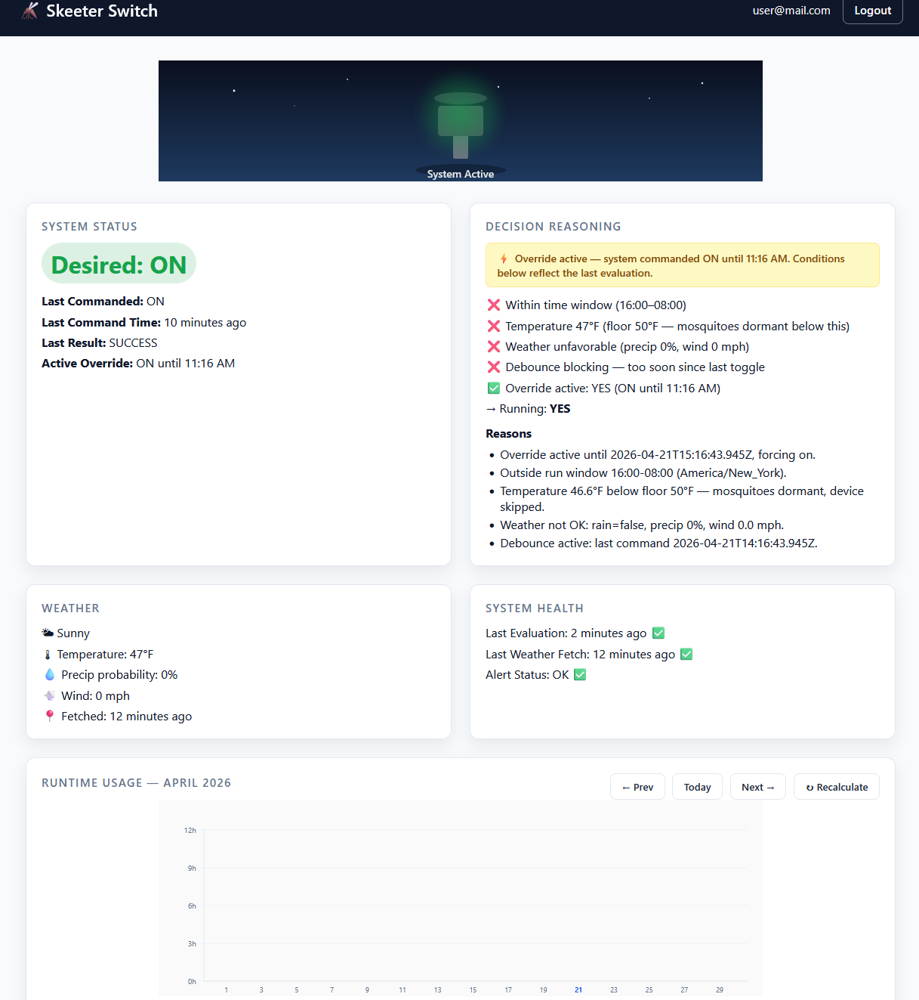
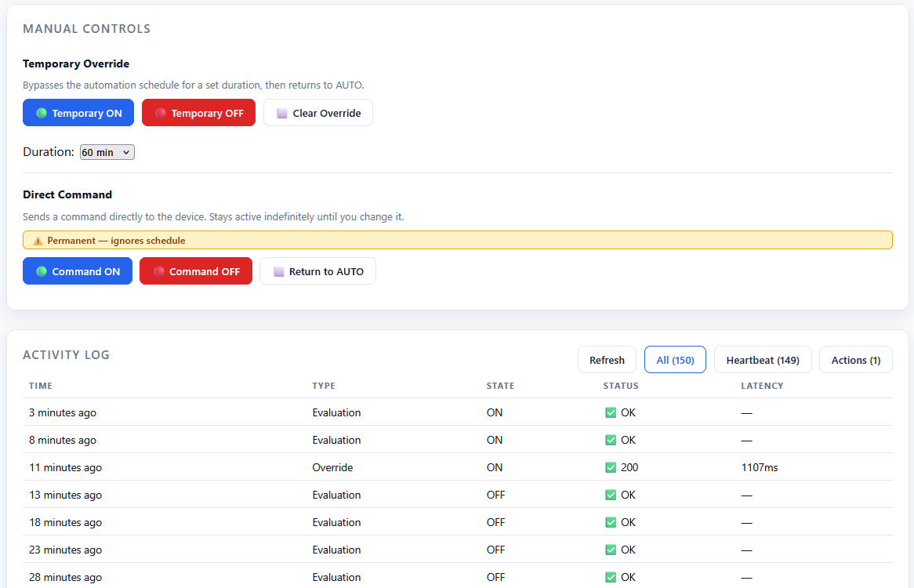
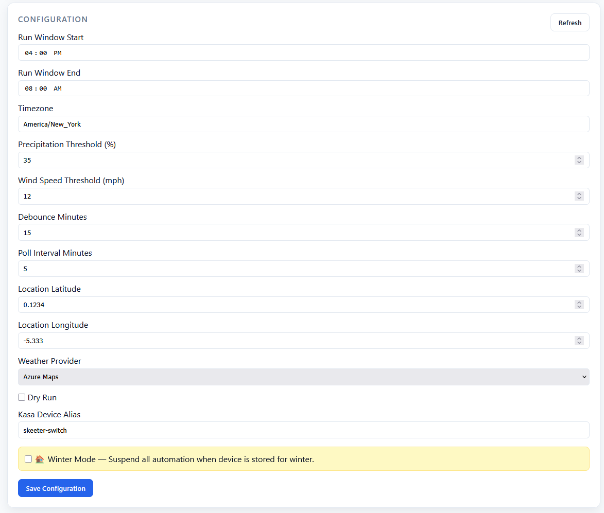

# skeeter-switch 🦟⚡

**Arctic Mosquito Killing System** — Cloud controller for a TP-Link Kasa EP40 smart plug that runs a bug zapper on a smart schedule based on weather, time of day, and manual overrides.





## Architecture

```
┌─────────────────────┐         ┌──────────────────────┐
│   React SPA         │  REST   │  Azure Functions      │
│   (Static Web Apps) │◄───────►│  (TypeScript)         │
│   Entra ID Auth     │         │                       │
└─────────────────────┘         │  ┌─────────────────┐  │
                                │  │ Decision Engine  │  │
                                │  │ (pure function)  │  │
                                │  └────────┬────────┘  │
                                │           │           │
                                │  ┌────────▼────────┐  │
                                │  │ TP-Link Cloud    │  │
                                │  │ API Client       │  │
                                │  └────────┬────────┘  │
                                └───────────┼───────────┘
                                            │
                    ┌───────────────────────┬┴──────────────────────┐
                    │                       │                       │
           ┌────────▼────────┐    ┌────────▼────────┐    ┌────────▼────────┐
           │ Azure Table     │    │ Azure Maps      │    │ TP-Link Kasa    │
           │ Storage         │    │ Weather API     │    │ EP40 Smart Plug │
           │ (state, config, │    │ (conditions &   │    │ (ON / OFF)      │
           │  logs, overrides)│    │  forecast)      │    │                 │
           └─────────────────┘    └─────────────────┘    └─────────────────┘
                    │
           ┌────────▼────────┐
           │ Azure Key Vault │
           │ (secrets via    │
           │  Managed ID)    │
           └─────────────────┘
```

### How It Works

1. **Timer trigger** fires every 5 minutes
2. **Decision Engine** evaluates: time window (18:00–06:00 ET), weather (no rain, precip < 30%, wind < 12 mph), debounce (15 min), and any active override
3. If desired state differs from last commanded state → **TP-Link Cloud API** fires
4. TP-Link Cloud API toggles **Kasa EP40** ON or OFF
5. Everything is logged to **Azure Table Storage** with full decision reasoning

### API Endpoints

| Method | Endpoint | Description |
|--------|----------|-------------|
| `GET` | `/api/status` | Current switch state, last decision, system health |
| `POST` | `/api/override` | Set override: `{ state: "on"\|"off"\|"auto", ttlMinutes?: number }` |
| `POST` | `/api/evaluate` | Force an immediate evaluation cycle |
| `POST` | `/api/command` | Direct command: `{ state: "on"\|"off" }` |
| `GET` | `/api/plan` | Forecast schedule: `?from=YYYY-MM-DD&to=YYYY-MM-DD` |
| `GET/PUT` | `/api/config` | Read/update config (admin only) |
| `GET` | `/api/logs` | Event log: `?limit=50` |

---

## TP-Link Kasa Setup

The system controls the Kasa EP40 via a direct HTTP client that calls the TP-Link Cloud API (`wap.tplinkcloud.com`). No third-party npm packages are used. The client supports session caching (10-minute TTL) and automatic child-device discovery for multi-outlet plugs. You need a TP-Link account and the device added to the Kasa app.

### 1. Create a Dedicated TP-Link Service Account

1. Go to [tplink.com](https://tplink.com) and sign up for a new account (recommended: use a service account email, not your personal account)
2. Verify your email

### 2. Add the EP40 to Kasa and Set the Device Alias

1. Download the Kasa app (iOS or Android) or use the web portal [tplink.com/iot](https://tplink.com/iot)
2. Sign in with your service account credentials
3. Add your TP-Link Kasa EP40 smart plug to your account
4. **Important:** The EP40 is a dual-outlet device. Name/alias the **child outlet** you want to control—this name becomes the `KASA_DEVICE_ALIAS` config value. Example: `skeeter-switch`. The system scans child devices by alias automatically.
5. Verify the device is online and responding in the Kasa app

### 3. Store Credentials in Azure Key Vault

Store your TP-Link service account credentials as secrets in Key Vault (these are referenced by the Function App via Managed Identity):

- **Secret name:** `tplink-username` → **Value:** your TP-Link service account email
- **Secret name:** `tplink-password` → **Value:** your TP-Link service account password

Do **not** use personal credentials; the service account isolates this application's access.

---

## Entra ID App Registration

Authentication is handled by Azure Static Web Apps built-in Entra ID integration.

### Create the App Registration

1. **Azure Portal** → **Microsoft Entra ID** → **App registrations** → **New registration**
2. **Name:** `skeeter-switch`
3. **Supported account types:** Accounts in this organizational directory only (Single tenant)
4. **Redirect URI:**
   - Platform: **Web**
   - URI: `https://{your-swa-hostname}/.auth/login/aad/callback`
5. Click **Register**
6. Note the **Application (client) ID** and **Directory (tenant) ID**
7. **Enable ID token issuance:** **Authentication** → **Implicit grant and hybrid flows** → check **ID tokens** → **Save**
8. **Set token version to v2:** **Manifest** → set `"accessTokenAcceptedVersion": 2` → **Save**
9. **Add optional claims:** **Token configuration** → **Add optional claim** → Token type: **ID** → check `email` and `preferred_username` → **Save**
10. Under **API permissions**, ensure `User.Read` (Microsoft Graph, delegated) is granted with admin consent
11. Under **Certificates & secrets** → **New client secret** → copy the **Value** immediately

### Configure Static Web Apps Auth

The `staticwebapp.config.json` file configures Entra ID auth with the tenant ID and references `AZURE_CLIENT_ID` / `AZURE_CLIENT_SECRET` from SWA application settings. Set these on the SWA resource:

```bash
az staticwebapp appsettings set --name <swa-name> --resource-group skeeter-switch-prod-rg \
  --setting-names AZURE_CLIENT_ID="<client-id>" AZURE_CLIENT_SECRET="<client-secret>"
```

See `DEPLOY.md` Phase 5 for detailed instructions.

---

## Conditional Access MFA

Enforce multi-factor authentication for all users accessing this application.

### Step-by-Step Portal Configuration

1. **Azure Portal** → **Microsoft Entra ID** → **Security** → **Conditional Access** → **New Policy**
2. **Name:** `skeeter-switch MFA Required`
3. **Users:** All users (or assign a specific security group)
4. **Target resources** → **Select apps** → Search and select the `skeeter-switch` Enterprise Application
5. **Conditions** → **Locations:** Any location
6. **Grant** → **Require multi-factor authentication** → Select **Microsoft Authenticator** as a valid method
7. **Session** (optional): Set **Sign-in frequency** to your preference (e.g., 12 hours)
8. **Enable policy:** On
9. Click **Create**

> **Note:** MFA is enforced by Entra Conditional Access, NOT by application code. The app itself does not need to implement MFA logic.

---

## Local Development

### Prerequisites

- **Node.js 18+** ([nodejs.org](https://nodejs.org/))
- **Azure Functions Core Tools v4** (`npm install -g azure-functions-core-tools@4`)
- **Azurite** for local Azure Table Storage (`npm install -g azurite`)
- **Azure CLI** (`az`) ([Install guide](https://learn.microsoft.com/en-us/cli/azure/install-azure-cli))

### Setup

```bash
# Clone the repo
git clone https://github.com/KMHouk/skeeter-switch.git
cd skeeter-switch

# Install dependencies (from project root)
npm install

# Copy the settings template and fill in dev values
cp local.settings.json.template local.settings.json
# Edit local.settings.json with your TP-Link credentials, Azure Maps key, etc.
```

**local.settings.json values:**

```json
{
  "IsEncrypted": false,
  "Values": {
    "AzureWebJobsStorage": "UseDevelopmentStorage=true",
    "FUNCTIONS_WORKER_RUNTIME": "node",
    "AZURE_MAPS_SUBSCRIPTION_KEY": "<your-azure-maps-key>",
    "TPLINK_USERNAME": "<your-tplink-service-account-email>",
    "TPLINK_PASSWORD": "<your-tplink-service-account-password>",
    "KASA_DEVICE_ALIAS": "skeeter-switch",
    "DRY_RUN": "true"
  }
}
```

### Run the Backend

```bash
# Start Azurite (in a separate terminal)
azurite --silent --location .azurite --debug .azurite/debug.log

# Build TypeScript and start Azure Functions (from project root)
npm run build
func start
```

### Run the Frontend

```bash
cd src/web
npm install
npm run dev
```

Set the environment variable so the frontend hits the local function host:

```bash
VITE_API_BASE_URL=http://localhost:7071
```

---

## Deployment

### Prerequisites

- **Azure CLI** (`az`) — logged in to your subscription
- **GitHub CLI** (`gh`) — authenticated
- An existing **Azure subscription**

### Step 1: Create OIDC Federation

See `DEPLOY.md` Phase 2 for full details. Summary:

```bash
# Create an Entra ID app for GitHub Actions
az ad app create --display-name "skeeter-switch-github-actions"
APP_ID=$(az ad app list --display-name "skeeter-switch-github-actions" --query "[0].appId" -o tsv)
az ad sp create --id "$APP_ID"

# Create federated credentials (main branch + prod environment)
az ad app federated-credential create --id "$APP_ID" --parameters '{
  "name": "skeeter-switch-main",
  "issuer": "https://token.actions.githubusercontent.com",
  "subject": "repo:KMHouk/skeeter-switch:ref:refs/heads/main",
  "audiences": ["api://AzureADTokenExchange"]
}'
az ad app federated-credential create --id "$APP_ID" --parameters '{
  "name": "skeeter-switch-prod",
  "issuer": "https://token.actions.githubusercontent.com",
  "subject": "repo:KMHouk/skeeter-switch:environment:prod",
  "audiences": ["api://AzureADTokenExchange"]
}'

# Assign Contributor + User Access Administrator on the resource group
SP_OBJ_ID=$(az ad sp show --id "$APP_ID" --query id -o tsv)
az role assignment create --role Contributor --assignee "$SP_OBJ_ID" \
  --scope /subscriptions/<subscription-id>/resourceGroups/skeeter-switch-prod-rg
az role assignment create --role "User Access Administrator" --assignee "$SP_OBJ_ID" \
  --scope /subscriptions/<subscription-id>/resourceGroups/skeeter-switch-prod-rg
```

### Step 2: Set GitHub Environment Secrets

```bash
gh secret set AZURE_CLIENT_ID        --env prod --body "$APP_ID"
gh secret set AZURE_TENANT_ID        --env prod --body "$(az account show --query tenantId -o tsv)"
gh secret set AZURE_SUBSCRIPTION_ID  --env prod --body "$(az account show --query id -o tsv)"
gh secret set AZURE_RESOURCE_GROUP   --env prod --body "skeeter-switch-prod-rg"
```

### Step 3: Deploy Infrastructure

```bash
gh workflow run infra-deploy.yml
```

### Step 4: Add Key Vault Secrets

```bash
az keyvault secret set --vault-name <vault-name> --name "tplink-username" --value "<your-tplink-email>"
az keyvault secret set --vault-name <vault-name> --name "tplink-password" --value "<your-tplink-password>"
az keyvault secret set --vault-name <vault-name> --name "azure-maps-subscription-key" --value "<your-maps-key>"
```

### Step 5: Deploy Functions

```bash
gh workflow run functions-deploy.yml
```

### Step 6: Deploy Static Web App

```bash
gh workflow run swa-deploy.yml
```

### Step 7: Configure SWA Auth & CORS

1. Register a separate Entra app for the SWA (see `DEPLOY.md` Phase 5)
2. Set SWA app settings: `AZURE_CLIENT_ID`, `AZURE_CLIENT_SECRET`
3. Set Function App app setting: `AZURE_ALLOWED_ORIGINS=https://<swa-hostname>`
4. See `DEPLOY.md` Phases 5–6 for complete instructions

---

## Security Hardening Checklist

- [ ] No secrets in source control (verified by `.gitignore`)
- [ ] TP-Link credentials in Key Vault, referenced by URI in App Settings
- [ ] Azure Maps key set as direct app setting or KV reference (see `DEPLOY.md` Phase 4.2 for caching caveats)
- [ ] Managed Identity used for Key Vault access (no access keys)
- [ ] OIDC used for GitHub Actions (no service principal secrets)
- [ ] All routes require authentication (`staticwebapp.config.json`)
- [ ] Admin routes require `admin` role
- [ ] Entra app registration: ID tokens enabled, token v2, optional claims configured
- [ ] Conditional Access MFA policy enabled for this app
- [ ] Function App requires HTTPS
- [ ] `AZURE_ALLOWED_ORIGINS` set to SWA hostname (no trailing slash)
- [ ] `dryRun=false` verified in production App Settings
- [ ] Application Insights alerts configured and enabled
- [ ] Key Vault soft-delete enabled
- [ ] Review App Registration "Who can access" — restrict to your tenant
- [ ] TP-Link service account credentials never committed to source control
- [ ] TP-Link Kasa device **child outlet** alias matches `KASA_DEVICE_ALIAS` config
- [ ] Monitor TP-Link Cloud API availability (`wap.tplinkcloud.com` — may change)

---

## Repo Layout

```
/skeeter-switch
├── infra/                      # Bicep IaC
│   ├── main.bicep              # Root template
│   ├── modules/                # Reusable Bicep modules
│   └── parameters/             # Environment parameter files
├── src/
│   ├── index.ts                # Azure Functions entry point
│   ├── functions/              # Individual function handlers
│   │   ├── evaluate/           # Timer-triggered (every 5 min)
│   │   ├── status/             # GET /api/status
│   │   ├── override/           # POST /api/override (toggles device)
│   │   ├── evaluate-http/      # POST /api/evaluate
│   │   ├── command/            # POST /api/command (direct control)
│   │   ├── plan/               # GET /api/plan (forecast schedule)
│   │   ├── config/             # GET/PUT /api/config
│   │   └── logs/               # GET /api/logs
│   ├── shared/                 # Shared modules
│   │   ├── kasa.ts             # TP-Link Cloud API client (direct HTTP)
│   │   ├── weather.ts          # Azure Maps weather client
│   │   ├── keyvault.ts         # Key Vault secret access
│   │   ├── decision.ts         # Decision engine (pure function)
│   │   ├── storage.ts          # Azure Table Storage operations
│   │   ├── auth.ts             # SWA auth middleware
│   │   ├── cors.ts             # CORS middleware
│   │   └── types.ts            # Shared TypeScript types
│   ├── __tests__/              # Jest test suite
│   └── web/                    # React SPA (Static Web Apps)
│       └── src/
│           ├── components/     # React components
│           ├── hooks/          # Custom React hooks
│           └── api/            # API client layer
├── .github/workflows/          # CI/CD pipelines
├── host.json                   # Azure Functions host config
├── package.json                # Root dependencies
├── tsconfig.json               # TypeScript config
├── DEPLOY.md                   # Full deployment runbook
└── README.md
```

---

## License

Private project. All rights reserved.
